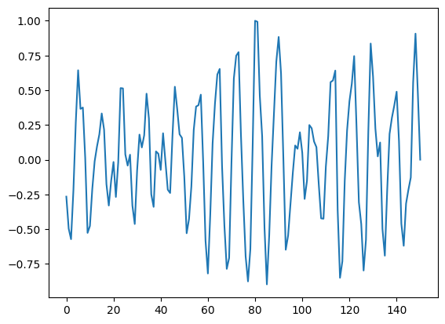
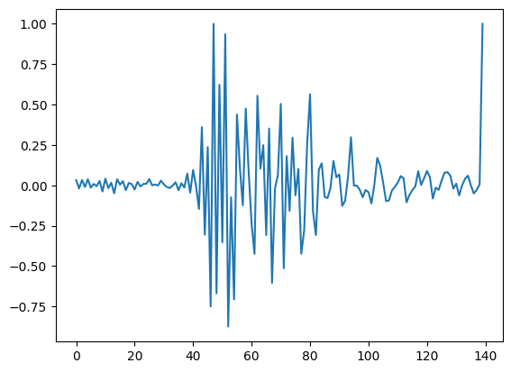
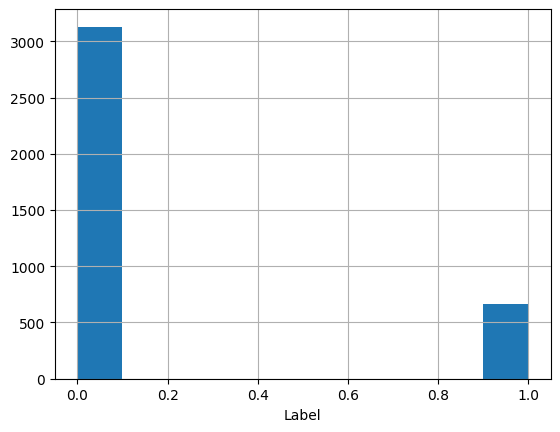
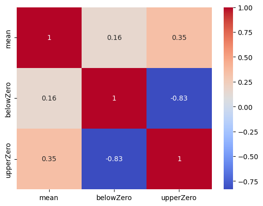
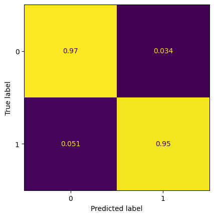

# TGT-hack
## Задача
Разработать модель для автоматического распознавания удара песчинок на акустических данных.

## Данные
В задаче хакатона использоваолся набор данных, который они получили в лаборатории. Условия при снятии замеров были максимально приближены к реальным условиям скважин: песчинки разных фракций (от 100 мкм до 700 мкм) были подмешаны в поток газа или воды и через маленькое отверстие инжектированы в основной поток, где находился регистрирующий прибор. Скорость чистого потока и с песком была разной: от 10 до 100 м/мин. Частота дискретизации аудио данных составляет 117.2 кГц.

## Метрика
Баллы за посылку считаются на основе метрики F1 по public выборке тестового датасета. После завершения приема новых посылок баллы каждого участника будут пересчитаны по полной выборке тестового датасета.

# Решение
## Визуализация данных
Большинство данных, где не падал песок выглядят так: 
 
Остальная часть данных, где падал песок выглядят так: 

## Распределение классов
По данному графику мы видим, что у нас дисбаланс классов  
Данных с лейблом 0 - 82.5% всей выборки 
Данных с лейблом 1 - 17.5% всей выборки 

## Новые фичи

# Модели, использованные в решении
## catboost
На кросс-валидации по метрике F1 набирает ~0.9263 

# Результаты
### На приватном скоре решение набрало 0.92
### 43 место из более чем 100 участников